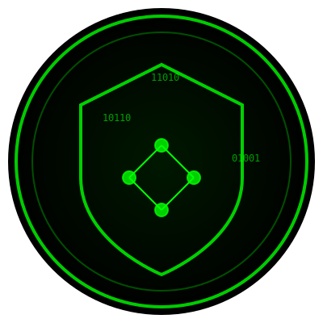

# 🛡️ Matrix VPN Monitor 

  

  
A sophisticated real-time VPN security monitoring tool built with JavaScript and modern web technologies.

## ✨ Features

### Core Security Monitoring
- 🔍 Real-time IP address monitoring and change detection
- 🌐 DNS leak detection across multiple DNS servers
- 🚫 Kill switch verification system
- 🔒 Private IP detection for VPN interfaces
- ⚡ Connection latency monitoring

### Advanced Protection
- 🕸️ WebRTC leak prevention and testing
- 🔐 Multi-layer proxy chain detection
- 📡 Network interface monitoring
- ⏱️ Automatic periodic security checks

### User Interface
- 🎯 Clean matrix-themed dashboard
- 📊 Real-time metrics display
- 📝 Detailed system logging
- 🚥 Visual status indicators

## 🔧 Technical Implementation

### Security Checks
- Multiple IP verification services with fallback mechanisms
- Comprehensive DNS leak detection using multiple testing methods
- WebRTC protection through connection candidate monitoring
- Kill switch verification through network interface tracking

### Monitoring System
- 5-second intervals for IP monitoring
- 10-second intervals for kill switch verification
- 30-second intervals for WebRTC leak detection
- Automatic monitoring termination on critical failures

## 💻 Key Components

1. **IP Detection**
   - Multiple API fallbacks
   - Private IP detection
   - Change monitoring

2. **DNS Security**
   - System DNS checks
   - Multiple server verification
   - Leak prevention

3. **Kill Switch**
   - Interface monitoring
   - Connection verification
   - Failure alerts

4. **WebRTC Protection**
   - Candidate monitoring
   - IP exposure prevention
   - Periodic verification

## 🚀 Performance Features

- Efficient resource usage through optimized check intervals
- Automatic cleanup of expired logs
- Smart duplicate log prevention
- Graceful error handling and recovery

## 🎨 UI Features

- Responsive matrix-themed design
- Real-time status updates
- Color-coded security indicators
- Detailed logging system
- Mobile-optimized layout

## ⚠️ Security Notes

- Implements multiple fallback mechanisms
- Comprehensive error handling
- Secure API implementations
- Cross-origin security considerations

## 🔄 Monitoring Lifecycle

1. Initialize security checks
2. Start continuous monitoring
3. Perform periodic verifications
4. Handle security events
5. Log system status
6. Manage connection failures

## 🛠️ Technical Stack

- Vanilla JavaScript
- Modern Web APIs
- CSS3 Animations
- HTML5 Features

## 🎯 Target Use Cases

- VPN security verification
- Network security monitoring
- Privacy leak detection
- Connection security testing

## 🚀 Live Demo
  <!-- YouTube Link -->

##  Access Tool 🔥 
https://kalkikrivadna.com/vpnmonitorob

  
## 📞 Support

